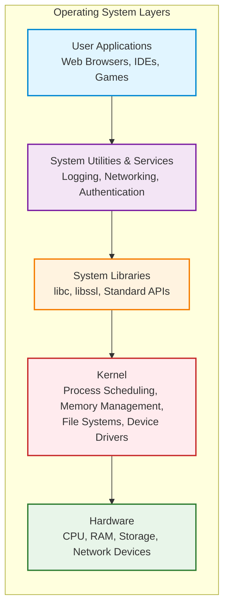

# Containers
## What are containers?

Containers are a form of virtualization that packages up an application and its dependencies into a single, portable unit. 

## Where do containers live?
Containers lives in 
- Container Repository
- Private Repository
- Public Repository for Docker (Docker Hub)

## Software Development Workflow before and after containers

Deploying software has evolved significantly. To understand the "revolution" of containers, we have to look at the painful processes that came before them.

Here is a detailed breakdown of how deployment worked before containers, how it works now, and exactly why that shift occurred.

---

### 1. The "Before" Era: Bare Metal & Virtual Machines

Before containers became the standard (roughly pre-2013), teams deployed applications in two main ways: **Bare Metal** or **Virtual Machines (VMs)**.

#### Phase A: The "Bare Metal" Days

Developers wrote code, and "Operations" installed it directly onto a physical server in a rack.

* **The Process:** You had to manually install the Operating System (OS), then the web server, then the libraries, and finally the app.
* **The Problem:** If you wanted to run two apps on one server, and App A needed `Python 2.7` while App B needed `Python 3.0`, you were in trouble. This was called **"Dependency Hell."** To avoid this, companies often bought a separate physical server for every single application, which was incredibly expensive and wasteful.

#### Phase B: The Virtual Machine (VM) Era

To solve the waste of bare metal, we started using VMs. This allowed us to run multiple "virtual" computers on one big physical server.

* **The Process:** Developers would package their code (usually as a `.jar`, `.war`, or zip file) and send it to the SysAdmin. The SysAdmin would provision a VM (which had a full Guest OS), install the necessary dependencies, and deploy the code.
* **The Bottleneck:**
* **"It works on my machine":** A developer might use Windows with specific libraries installed. The production server uses Linux with slightly different library versions. The code crashes in production, leading to the developer saying, "I don't know why; it works on my machine."
* **Heavy & Slow:** Every VM required a full Operating System (e.g., a full install of Linux or Windows). This took up GBs of space and minutes to boot up.

---

### 2. The "After" Era: Container Deployment

Containers changed the unit of delivery. Instead of delivering just the *code*, developers now deliver the *entire environment*.

#### The New Process (The Docker Workflow)

1. **The Manifest (Dockerfile):** The developer writes a text file called a `Dockerfile`. This file lists the OS, libraries, and code needed.
* *Example:* "Start with Alpine Linux, install Python 3.9, copy my code files, and run this command."

2. **The Build:** The developer runs a build command. This creates a **Container Image**. This image is a sealed, read-only snapshot of the application *and* its environment.
3. **The Registry:** The developer pushes this image to a central "library" (like Docker Hub or AWS ECR).
4. **The Run:** The server pulls the image and runs it.

Because the image already contains the OS libraries and dependencies, the server doesn't need to have anything installed other than the Container Runtime (like Docker).

---

### 3. Key Benefits of Using Containers

The shift to containers brought five major benefits that solved the headaches of the VM era:

#### 1. Solves "It Works on My Machine" (Consistency)

This is the biggest benefit. Because the container includes the code *and* the specific versions of all libraries, it runs exactly the same way on a developer's laptop as it does on a massive production server. The environment is no longer a variable; it is immutable.

#### 2. Efficiency (Lightweight)

Unlike a VM, a container does not need a full Guest Operating System.

* **VM:** 1 Application = 1 App + **1 Full OS (GBs of size)**.
* **Container:** 1 Application = 1 App + Minimal Binaries (MBs of size).
Containers share the host's OS Kernel, meaning you can fit dozens of containers on a server that could only hold two or three VMs.

#### 3. Speed (Instant Startup)

A VM has to boot up an entire Operating System (BIOS, device drivers, init processes), which takes minutes. A container is just a process starting up; it creates a sandboxed environment in milliseconds. This allows apps to scale up instantly when traffic spikes.

#### 4. Isolation

If one container crashes or is hacked, it is isolated from the others. You can run `Python 2.7` in one container and `Python 3.0` in another on the very same machine without any conflict.

#### 5. Immutable Infrastructure

In the old days, if a server had a bug, an admin would SSH in and try to "patch" it live. This often caused "configuration drift" where servers became unique "snowflakes."
With containers, you never patch a running container. You simply fix the code, build a *new* image, kill the old container, and start the new one. This ensures the system is always in a known, clean state.

## Docker Images
A Docker image consists of a series of read-only layers.

-   **Base Image:** The foundational layer (e.g., Alpine Linux, Ubuntu). It provides the core OS filesystem and is optimized for size.
-   **Intermediate Layers:** Contain dependencies, libraries, and configuration instructions added on top of the base image.
-   **Application Layer:** The final layer containing your application code and entrypoint.

## Container vs. Image

Understanding the distinction between a **Container Image** and a **Container** is fundamental.

### 1. What is a Container Image?
An **Image** is a static, read-only template that includes everything needed to run an application: code, runtime, libraries, environment variables, and configuration files.

*   **State:** Inert (exists on disk). It does not consume CPU or memory until run.
*   **Mutability:** Immutable. You cannot change an image once it is built; you must build a new one to apply changes.
*   **Architecture:** Built from stacked read-only layers (OS, Dependencies, Code).

### 2. What is a Container?
A **Container** is a running instance of an image. It brings the static image to life as an isolated process.

*   **State:** Active (consumes CPU & Memory). You can start, stop, and interact with it.
*   **Mutability:** Ephemeral. It adds a thin Read/Write layer on top of the image. Changes made here are lost when the container is removed, unless persisted in Volumes.
*   **Layering:** The container layer sits on top of the image layers, allowing modification without altering the underlying image.

## Docker vs Virtual Machine

### The Anatomy of an Operating System

An operating system is built in layers, each abstracting complexity from the layer above it. At the foundation sits the kernel, which directly manages hardware resources like CPU, memory, storage, and network devices. The kernel handles critical tasks: scheduling processes, allocating memory, managing file systems, and controlling device drivers.

Above the kernel are system libraries that provide standardized interfaces for applications to interact with kernel services without needing to know hardware details. Then come system utilities and services—background processes that handle logging, networking, user authentication, and other housekeeping tasks. At the top layer are user applications that people actually interact with.

This layered architecture exists because hardware is complex and diverse. The OS creates a consistent, stable interface so developers don't need to write different code for every processor or storage device.

