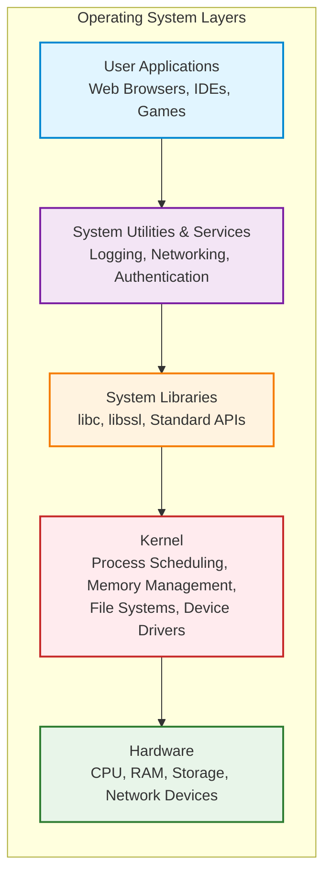
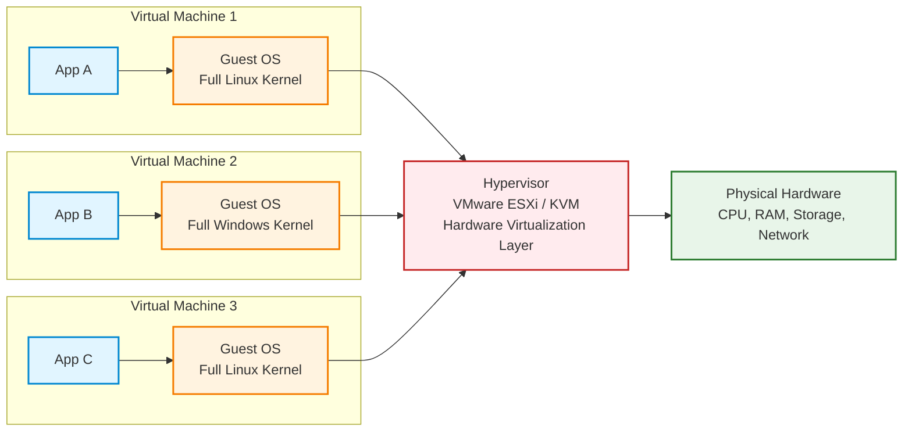
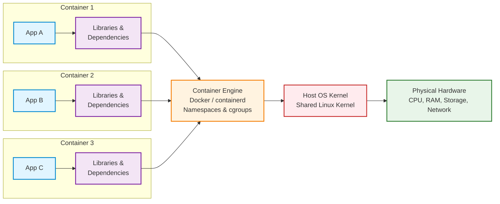

# Containers
## What are containers?

Containers are a form of virtualization that packages up an application and its dependencies into a single, portable unit. 

## Where do containers live?
Containers lives in 
- Container Repository
- Private Repository
- Public Repository for Docker (Docker Hub)

## Software Development Workflow before and after containers

Deploying software has evolved significantly. To understand the "revolution" of containers, we have to look at the painful processes that came before them.

Here is a detailed breakdown of how deployment worked before containers, how it works now, and exactly why that shift occurred.

---

### 1. The "Before" Era: Bare Metal & Virtual Machines

Before containers became the standard (roughly pre-2013), teams deployed applications in two main ways: **Bare Metal** or **Virtual Machines (VMs)**.

#### Phase A: The "Bare Metal" Days

Developers wrote code, and "Operations" installed it directly onto a physical server in a rack.

* **The Process:** You had to manually install the Operating System (OS), then the web server, then the libraries, and finally the app.
* **The Problem:** If you wanted to run two apps on one server, and App A needed `Python 2.7` while App B needed `Python 3.0`, you were in trouble. This was called **"Dependency Hell."** To avoid this, companies often bought a separate physical server for every single application, which was incredibly expensive and wasteful.

#### Phase B: The Virtual Machine (VM) Era

To solve the waste of bare metal, we started using VMs. This allowed us to run multiple "virtual" computers on one big physical server.

* **The Process:** Developers would package their code (usually as a `.jar`, `.war`, or zip file) and send it to the SysAdmin. The SysAdmin would provision a VM (which had a full Guest OS), install the necessary dependencies, and deploy the code.
* **The Bottleneck:**
* **"It works on my machine":** A developer might use Windows with specific libraries installed. The production server uses Linux with slightly different library versions. The code crashes in production, leading to the developer saying, "I don't know why; it works on my machine."
* **Heavy & Slow:** Every VM required a full Operating System (e.g., a full install of Linux or Windows). This took up GBs of space and minutes to boot up.


---

### 2. The "After" Era: Container Deployment

Containers changed the unit of delivery. Instead of delivering just the *code*, developers now deliver the *entire environment*.

#### The New Process (The Docker Workflow)

1. **The Manifest (Dockerfile):** The developer writes a text file called a `Dockerfile`. This file lists the OS, libraries, and code needed.
* *Example:* "Start with Alpine Linux, install Python 3.9, copy my code files, and run this command."


2. **The Build:** The developer runs a build command. This creates a **Container Image**. This image is a sealed, read-only snapshot of the application *and* its environment.
3. **The Registry:** The developer pushes this image to a central "library" (like Docker Hub or AWS ECR).
4. **The Run:** The server pulls the image and runs it.

Because the image already contains the OS libraries and dependencies, the server doesn't need to have anything installed other than the Container Runtime (like Docker).

---

### 3. Key Benefits of Using Containers

The shift to containers brought five major benefits that solved the headaches of the VM era:

#### 1. Solves "It Works on My Machine" (Consistency)

This is the biggest benefit. Because the container includes the code *and* the specific versions of all libraries, it runs exactly the same way on a developer's laptop as it does on a massive production server. The environment is no longer a variable; it is immutable.

#### 2. Efficiency (Lightweight)

Unlike a VM, a container does not need a full Guest Operating System.

* **VM:** 1 Application = 1 App + **1 Full OS (GBs of size)**.
* **Container:** 1 Application = 1 App + Minimal Binaries (MBs of size).
Containers share the host's OS Kernel, meaning you can fit dozens of containers on a server that could only hold two or three VMs.

#### 3. Speed (Instant Startup)

A VM has to boot up an entire Operating System (BIOS, device drivers, init processes), which takes minutes. A container is just a process starting up; it creates a sandboxed environment in milliseconds. This allows apps to scale up instantly when traffic spikes.

#### 4. Isolation

If one container crashes or is hacked, it is isolated from the others. You can run `Python 2.7` in one container and `Python 3.0` in another on the very same machine without any conflict.

#### 5. Immutable Infrastructure

In the old days, if a server had a bug, an admin would SSH in and try to "patch" it live. This often caused "configuration drift" where servers became unique "snowflakes."
With containers, you never patch a running container. You simply fix the code, build a *new* image, kill the old container, and start the new one. This ensures the system is always in a known, clean state.

## Docker Images
A Docker image consists of a series of read-only layers.

-   **Base Image:** The foundational layer (e.g., Alpine Linux, Ubuntu). It provides the core OS filesystem and is optimized for size.
-   **Intermediate Layers:** Contain dependencies, libraries, and configuration instructions added on top of the base image.
-   **Application Layer:** The final layer containing your application code and entrypoint.

## Container vs. Image

Understanding the distinction between a **Container Image** and a **Container** is fundamental.

### 1. What is a Container Image?
An **Image** is a static, read-only template that includes everything needed to run an application: code, runtime, libraries, environment variables, and configuration files.

*   **State:** Inert (exists on disk). It does not consume CPU or memory until run.
*   **Mutability:** Immutable. You cannot change an image once it is built; you must build a new one to apply changes.
*   **Architecture:** Built from stacked read-only layers (OS, Dependencies, Code).

### 2. What is a Container?
A **Container** is a running instance of an image. It brings the static image to life as an isolated process.

*   **State:** Active (consumes CPU & Memory). You can start, stop, and interact with it.
*   **Mutability:** Ephemeral. It adds a thin Read/Write layer on top of the image. Changes made here are lost when the container is removed, unless persisted in Volumes.
*   **Layering:** The container layer sits on top of the image layers, allowing modification without altering the underlying image.

## Docker vs Virtual Machine

### The Anatomy of an Operating System

An operating system is built in layers, each abstracting complexity from the layer above it. At the foundation sits the kernel, which directly manages hardware resources like CPU, memory, storage, and network devices. The kernel handles critical tasks: scheduling processes, allocating memory, managing file systems, and controlling device drivers.

Above the kernel are system libraries that provide standardized interfaces for applications to interact with kernel services without needing to know hardware details. Then come system utilities and services—background processes that handle logging, networking, user authentication, and other housekeeping tasks. At the top layer are user applications that people actually interact with.

This layered architecture exists because hardware is complex and diverse. The OS creates a consistent, stable interface so developers don't need to write different code for every processor or storage device.



### What virtualization targets?
Virtualization emerged to solve a fundamental problem: how to run multiple isolated operating systems on a single physical machine. Traditional virtualization (using hypervisors) virtualizes the hardware layer itself.

A hypervisor like VMware ESXi or KVM sits between the physical hardware and guest operating systems, presenting each guest with what appears to be complete, dedicated hardware—virtual CPUs, virtual memory, virtual network cards, virtual disks. Each virtual machine (VM) runs its own full operating system kernel, completely unaware it's sharing physical resources with other VMs. The hypervisor manages this illusion, translating virtual hardware operations into physical ones and ensuring isolation between guests.

This is powerful but heavyweight. Each VM needs its own complete OS installation, which means gigabytes of disk space, significant memory overhead, and minutes to boot up. You're essentially running multiple complete computers on one physical machine.



### Containers: Virtualizing at a Different Layer
Containers take a fundamentally different approach. Instead of virtualizing hardware, they virtualize at the operating system layer. All containers on a host share the same kernel but are isolated from each other through kernel features like namespaces and cgroups.

When you run a container, you're not booting a new operating system. You're creating an isolated process environment that has its own view of the filesystem, network interfaces, process tree, and user IDs—but it's all managed by the host's single kernel. The container engine (like Docker) uses Linux namespaces to create these isolated views and cgroups to limit resource usage.

This is why containers are so lightweight. A container image only needs the application code, its dependencies, and minimal filesystem utilities. It doesn't need kernel, drivers, or init systems. Containers typically measure in megabytes rather than gigabytes, start in seconds rather than minutes, and use far less memory.



## Docker Architecture: Components and How They Work Together

At its core, Docker uses a **client-server architecture**. The Docker client talks to the Docker daemon, which does the heavy lifting of building, running, and distributing your Docker containers.

These two components can run on the same system, or you can connect a Docker client to a remote Docker daemon. They communicate using a REST API, over UNIX sockets or a network interface.

Here is a breakdown of the critical components and how they interact.

---

### 1. The Core Components

#### A. The Docker Client (`docker`)

This is the primary way many Docker users interact with Docker. When you use commands such as `docker run`, the client sends these commands to `dockerd` (the daemon), which carries them out. The `docker` command uses the Docker API. The Docker client can communicate with more than one daemon.

#### B. The Docker Host (The Daemon)

The Docker daemon (`dockerd`) listens for Docker API requests and manages Docker objects such as images, containers, networks, and volumes. A daemon can also communicate with other daemons to manage Docker services.

> **Note on Runtimes:** Under the hood, the daemon relies on lower-level tools to actually interface with the OS kernel.
> * **containerd:** A high-level runtime that manages the container lifecycle (pulling images, storage, execution).
> * **runc:** A low-level CLI tool that actually spawns and runs containers according to the OCI (Open Container Initiative) specification.
> 
> 

#### C. Docker Registries

A Docker registry stores Docker images. Docker Hub is a public registry that anyone can use, and Docker is configured to look for images on Docker Hub by default. You can also run your own private registry.

* **Public:** Docker Hub.
* **Private:** AWS ECR, Google Artifact Registry, Azure ACR, or self-hosted.

---

### 2. Docker Objects

When you use Docker, you are creating and using images, containers, networks, volumes, plugins, and other objects.

| Object | Description | Analogy |
| --- | --- | --- |
| **Image** | A read-only template with instructions for creating a Docker container. Often based on another image, with some additional customization. | The "Recipe" or "Class" definition. |
| **Container** | A runnable instance of an image. You can create, start, stop, move, or delete a container using the Docker API or CLI. | The "Cake" or "Object" instance. |
| **Volume** | The preferred mechanism for persisting data generated by and used by Docker containers. | An external hard drive plugged into the container. |
| **Network** | Allows containers to communicate with each other and the outside world. | Virtual cabling connecting machines. |

---

### 3. How They Work Together: The Lifecycle

To understand the architecture in motion, let's trace what happens when you run a simple command like:
`docker run -i -t ubuntu /bin/bash`

#### Step 1: The Request

The **Docker Client** parses your command. It translates `run` into an API request and sends it to the **Docker Daemon** (`dockerd`).

#### Step 2: Image Check & Pull

The Daemon checks its local image cache.

* **If the `ubuntu` image exists locally:** It proceeds to the next step.
* **If the image is missing:** The Daemon talks to the **Docker Registry** (e.g., Docker Hub), downloads (pulls) the `ubuntu` image, and stores it locally.

#### Step 3: Container Creation

The Daemon creates a new **Container** from that image. It essentially creates a writeable layer on top of the read-only image layers.

#### Step 4: Runtime Execution

The Daemon instructs **containerd** to start the container. `containerd` uses **runc** to interface with the Linux kernel (using Namespaces for isolation and Control Groups for resource limiting) to create the isolated process.

#### Step 5: I/O Stream

Because you used the `-i` (interactive) and `-t` (pseudo-TTY) flags, the Daemon connects the input/output streams of the container back to your **Client** terminal. You now see the bash prompt inside the container.

---

### 4. Key Underlying Technologies

Docker is written in the Go programming language and takes advantage of several features of the Linux kernel to deliver its functionality:

* **Namespaces:** The technology that provides the *isolation*. Docker uses namespaces to provide the isolated workspace called the container. When you run a container, Docker creates a set of namespaces for that container (e.g., `pid` for processes, `net` for networking).
* **Control Groups (cgroups):** The technology that provides *resource management*. This allows the Docker engine to share available hardware resources to containers and optionally enforce limits and constraints (e.g., limiting a container to 512MB of RAM).
* **Union File Systems (UnionFS):** Efficient file systems that operate by creating layers, making them very lightweight and fast. This is why Docker images are built in layers.

---

## Essential Docker Commands

### Image Management

#### Pulling Images from a Registry
To download an image from Docker Hub (or another configured registry):

```bash
docker pull redis
```

This command downloads the `redis` image with the `latest` tag to your local machine.

#### Listing Local Images
To view all images stored locally:

```bash
docker images
```

This displays a table showing:
- Repository name
- Tag
- Image ID
- Creation date
- Size

#### Pulling Specific Image Versions
To pull a specific version (tag) of an image:

```bash
docker run redis:8.4.0
```

If the image doesn't exist locally, `docker run` automatically pulls it before creating the container.

---

### Container Lifecycle Management

#### Creating and Running Containers

**Foreground Mode (Attached):**
```bash
docker run redis
```

This starts a Redis container in the foreground. The terminal is attached to the container's output stream. Pressing `CTRL+C` sends a stop signal to the container.

**Detached Mode (Background):**
```bash
docker run -d redis
```

The `-d` flag runs the container in detached mode, returning control to your terminal immediately. The container runs in the background.

#### Viewing Running Containers
To list all currently running containers:

```bash
docker ps
```

Output includes:
- Container ID
- Image name
- Command
- Creation time
- Status
- Ports
- Container name

**Viewing All Containers (Including Stopped):**
```bash
docker ps -a
```

The `-a` flag shows all containers regardless of their state (running, stopped, exited).

#### Stopping Containers
To gracefully stop a running container:

```bash
docker stop <container_id>
```

Replace `<container_id>` with the actual container ID (visible from `docker ps`). Docker sends a `SIGTERM` signal, allowing the process to shut down gracefully. If the container doesn't stop within the timeout period (default 10 seconds), Docker sends a `SIGKILL` signal.

**Example:**
```bash
docker stop 3f2a1b8c9d4e
```
#### Starting Stopped Containers
To restart a stopped container:

```bash
docker start <container_id>
```
#### Removing Containers
To delete a stopped container:

```bash
docker rm <container_id>
```

To force-remove a running container:

```bash
docker rm -f <container_id>
```

---

## Port Mapping: Connecting Containers to the Outside World

### Understanding Container Networking Isolation

By default, Docker containers run in an **isolated network environment**. This means:

*   Each container has its own network namespace with its own network interfaces, IP addresses, and routing tables.
*   A container can expose services on any port internally (e.g., a web server listening on port 80).
*   However, these ports are **not accessible from the host machine or external networks** unless explicitly mapped.

This isolation is a security feature—containers cannot accidentally expose services to the outside world.
### The Concept: Host Port vs. Container Port

To make a containerized service accessible, you must create a **port mapping** (also called port binding or port publishing) that bridges the container's isolated network to the host's network.

**Container Port:** The port on which the application inside the container is listening.
*   Example: An Nginx web server inside a container listens on port `80` by default.

**Host Port:** The port on the host machine that forwards traffic to the container port.
*   Example: You might map host port `8080` to container port `80`, so accessing `localhost:8080` on your machine routes traffic to the container's port `80`.

**The Mapping:** `<host_port>:<container_port>`

When you map ports, Docker sets up **iptables rules** (on Linux) or equivalent networking rules to forward traffic from the host port to the container port.

---
### Port Mapping Syntax

The `-p` (or `--publish`) flag is used to map ports when running a container:

```bash
docker run -p <host_port>:<container_port> <image>
```

**Example:**
```bash
docker run -p 8080:80 nginx
```

This command:
1.  Starts an Nginx container.
2.  Nginx inside the container listens on port `80`.
3.  Maps host port `8080` to container port `80`.
4.  You can now access Nginx by visiting `http://localhost:8080` in your browser.

---

### Common Port Mapping Patterns

#### 1. Single Port Mapping
Map one host port to one container port:

```bash
docker run -d -p 3000:3000 node-app
```

*   Host port `3000` → Container port `3000`
*   Access via: `http://localhost:3000`

#### 2. Multiple Port Mappings
Map multiple ports by using multiple `-p` flags:

```bash
docker run -d -p 8080:80 -p 8443:443 nginx
```

*   Host port `8080` → Container port `80` (HTTP)
*   Host port `8443` → Container port `443` (HTTPS)

#### 3. Mapping to Different Host Ports
Useful when running multiple instances of the same service:

```bash
docker run -d -p 9001:80 --name web1 nginx
docker run -d -p 9002:80 --name web2 nginx
```

*   `web1` accessible at `http://localhost:9001`
*   `web2` accessible at `http://localhost:9002`

Both containers run Nginx on port `80` internally, but they're accessible on different host ports.

#### 4. Binding to Specific Host Interfaces
By default, Docker binds to all network interfaces (`0.0.0.0`). You can bind to a specific IP:

```bash
docker run -d -p 127.0.0.1:8080:80 nginx
```

*   Only accessible from `localhost` (not from external networks).
*   Useful for security when you don't want external access.

To bind to a specific network interface:
```bash
docker run -d -p 192.168.1.100:8080:80 nginx
```

#### 5. Random Host Port Assignment
Let Docker automatically assign an available host port:

```bash
docker run -d -P nginx
```

The `-P` (capital P) flag publishes **all exposed ports** to random available host ports.

To see which ports were assigned:
```bash
docker ps
```

Or:
```bash
docker port <container_id>
```

**Example output:**
```
80/tcp -> 0.0.0.0:32768
443/tcp -> 0.0.0.0:32769
```

---

### Inspecting Port Mappings

#### View Port Mappings for Running Containers
```bash
docker ps
```

The `PORTS` column shows the mappings:
```
CONTAINER ID   IMAGE     PORTS                  
abc123def456   nginx     0.0.0.0:8080->80/tcp
```

This means host port `8080` is mapped to container port `80`.

#### View Detailed Port Information
```bash
docker port <container_name_or_id>
```

**Example:**
```bash
docker port web1
```

**Output:**
```
80/tcp -> 0.0.0.0:8080
```

#### Inspect Full Container Configuration
```bash
docker inspect <container_id>
```

Look for the `"Ports"` section in the JSON output for detailed networking information.

---

### Practical Examples

#### Example 1: Running a Web Server
Run an Nginx web server accessible on port `8080`:

```bash
docker run -d -p 8080:80 --name my-nginx nginx
```

*   Visit `http://localhost:8080` in your browser.
*   The Nginx default page should appear.

#### Example 2: Running a Database
Run a PostgreSQL database accessible on the default port `5432`:

```bash
docker run -d -p 5432:5432 --name my-postgres -e POSTGRES_PASSWORD=secret postgres
```

*   Connect to the database using: `localhost:5432`
*   Username: `postgres`, Password: `secret`

#### Example 3: Running Multiple Redis Instances
Run two Redis instances on different ports:

```bash
docker run -d -p 6379:6379 --name redis1 redis
docker run -d -p 6380:6379 --name redis2 redis
```

*   `redis1` accessible on `localhost:6379`
*   `redis2` accessible on `localhost:6380`

#### Example 4: Development Environment
Run a Node.js app with live reload on port `3000`:

```bash
docker run -d -p 3000:3000 -v $(pwd):/app --name node-dev node:18
```

*   Maps port `3000`
*   Mounts current directory for live code updates

---

### Understanding the Network Flow

When you access `http://localhost:8080`:

1.  **Request hits the host** on port `8080`.
2.  **Docker's iptables rules** intercept the traffic.
3.  **Traffic is forwarded** to the container's network namespace.
4.  **The container receives** the request on port `80`.
5.  **The application** (e.g., Nginx) processes the request.
6.  **Response travels back** through the same path.

This happens transparently—the application inside the container doesn't know it's being accessed via port `8080`.

---


