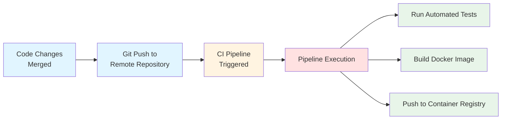

# GitLab CI/CD

## What is CI/CD?

CI/CD stands for **Continuous Integration** and **Continuous Delivery/Deployment**. It is a methodology that enables development teams to deliver code changes more frequently and reliably through automation.

---

## Continuous Integration (CI)

### Definition

Continuous Integration is a development practice where developers frequently merge their code changes into a shared repository—typically multiple times per day. Each integration is automatically verified by building the application and running automated tests.

### Core Principles

1. **Single Source Repository**: All developers commit to a shared mainline (usually `main` or `master` branch)
2. **Automated Builds**: Every commit triggers an automated build process
3. **Self-Testing Builds**: The build process includes automated tests to validate code quality
4. **Fast Feedback**: Developers receive immediate feedback on their changes
5. **Trunk-Based Development**: Short-lived feature branches merged frequently to reduce integration complexity

### What Happens in a CI Pipeline?

```
Developer Pushes Code
        │
        ▼
┌───────────────────┐
│   Code Checkout   │
└─────────┬─────────┘
          │
          ▼
┌───────────────────┐
│  Install Dependencies  │
└─────────┬─────────┘
          │
          ▼
┌───────────────────┐
│   Static Analysis │  ← Linting, Code Style, SAST
└─────────┬─────────┘
          │
          ▼
┌───────────────────┐
│    Unit Tests     │
└─────────┬─────────┘
          │
          ▼
┌───────────────────┐
│  Integration Tests│
└─────────┬─────────┘
          │
          ▼
┌───────────────────┐
│   Build Artifact  │
└─────────┬─────────┘
          │
          ▼
┌───────────────────┐
│  Security Scans   │  ← Dependency scanning, Container scanning
└───────────────────┘
```

### Industry Best Practices for CI (2024-2025)

| Practice | Description |
|----------|-------------|
| **Shift-Left Testing** | Run tests as early as possible in the pipeline |
| **Parallel Test Execution** | Split test suites to run concurrently for faster feedback |
| **Caching** | Cache dependencies and build artifacts to speed up pipelines |
| **Ephemeral Build Environments** | Use containerized, reproducible build environments |
| **Security as Code** | Integrate SAST, DAST, and dependency scanning into every build |
| **Pipeline as Code** | Define CI configuration in version-controlled files (`.gitlab-ci.yml`) |

### Benefits of CI

- **Early Bug Detection**: Issues are caught within minutes of being introduced
- **Reduced Integration Risk**: Small, frequent integrations are easier to manage than large merges
- **Improved Code Quality**: Automated quality gates enforce standards
- **Faster Development Cycles**: Developers spend less time debugging integration issues
- **Increased Confidence**: Teams can release more frequently with confidence

---

## Continuous Delivery (CD)

### Definition

Continuous Delivery is an extension of CI that ensures code is always in a deployable state. After passing all automated tests, the application can be released to production at any time with the push of a button.

### Key Characteristics

- Every change that passes automated tests is **potentially releasable**
- Deployment to production requires **manual approval**
- Release decisions are **business decisions**, not technical ones
- Maintains a **deployment pipeline** that can deliver to any environment

---

## Continuous Deployment

### Definition

Continuous Deployment takes Continuous Delivery one step further—every change that passes all stages of the production pipeline is **automatically released to production** without human intervention.

### CI vs CD vs CD: The Spectrum

```
┌─────────────────────────────────────────────────────────────────────────┐
│                                                                         │
│  Continuous Integration                                                 │
│  ├── Automated builds                                                   │
│  ├── Automated testing                                                  │
│  └── Merge to main branch                                               │
│                                                                         │
│      Continuous Delivery                                                │
│      ├── Everything in CI, plus:                                        │
│      ├── Automated deployment to staging                                │
│      ├── Manual approval for production                                 │
│      └── One-click production deployments                               │
│                                                                         │
│          Continuous Deployment                                          │
│          ├── Everything in Continuous Delivery, plus:                   │
│          └── Automated production deployments                           │
│                                                                         │
└─────────────────────────────────────────────────────────────────────────┘
```

---

## Modern CD Pipeline Architecture

### Typical CD Pipeline Stages

```
┌──────────┐    ┌──────────┐    ┌──────────┐    ┌──────────┐    ┌──────────┐
│  Build   │───▶│   Test   │───▶│  Stage   │───▶│  Review  │───▶│  Prod    │
└──────────┘    └──────────┘    └──────────┘    └──────────┘    └──────────┘
                                     │               │
                                     ▼               ▼
                               ┌──────────┐    ┌──────────┐
                               │ Smoke    │    │ Manual   │
                               │ Tests    │    │ Approval │
                               └──────────┘    └──────────┘
```

### Deployment Strategies (Industry Standard)

| Strategy | Description | Use Case |
|----------|-------------|----------|
| **Blue-Green** | Maintain two identical environments; switch traffic instantly | Zero-downtime deployments |
| **Canary** | Gradually roll out changes to a small subset of users first | Risk mitigation for critical services |
| **Rolling** | Incrementally update instances in a deployment group | Kubernetes deployments, minimal resource overhead |
| **Feature Flags** | Deploy code with features disabled, enable progressively | A/B testing, gradual rollouts |
| **Shadow/Dark Launch** | Deploy to production but don't serve real traffic | Testing with production data patterns |

### GitLab CI/CD Core Concepts

A typical GitLab CI/CD workflow follows this sequence:



**Pipeline Configuration**

GitLab CI/CD pipelines are defined using a declarative YAML configuration file (`.gitlab-ci.yml`) stored in the repository root. This file specifies:

- **Stages**: The sequential phases of the pipeline (build, test, deploy)
- **Jobs**: Individual tasks that execute within each stage
- **Variables**: Environment-specific configuration values
- **Rules**: Conditions that determine when jobs run
- **Artifacts**: Files passed between pipeline stages

This "Pipeline as Code" approach ensures that CI/CD configuration is version-controlled, reviewable, and reproducible across environments.