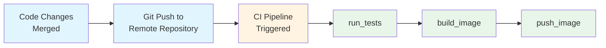
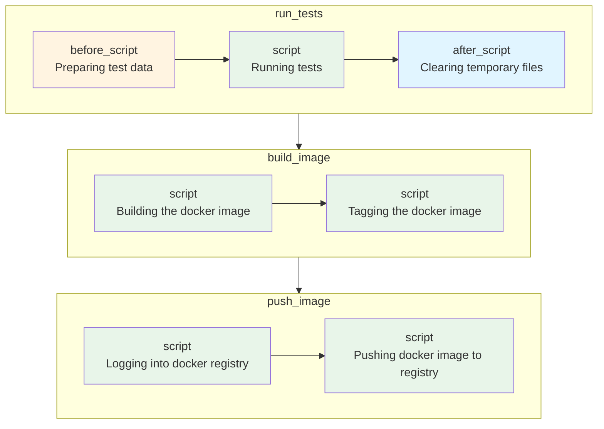
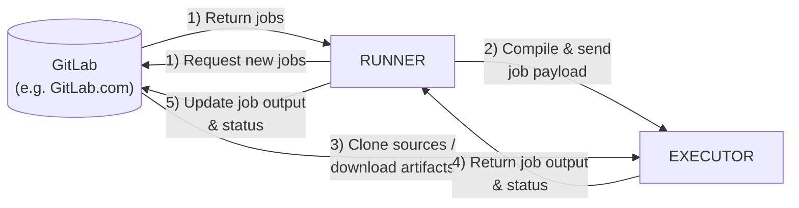

# GitLab CI/CD

## What is CI/CD?

CI/CD stands for **Continuous Integration** and **Continuous Delivery/Deployment**. It is a methodology that enables development teams to deliver code changes more frequently and reliably through automation.

---

## Continuous Integration (CI)

### Definition

Continuous Integration is a development practice where developers frequently merge their code changes into a shared repository—typically multiple times per day. Each integration is automatically verified by building the application and running automated tests.

### Core Principles

1. **Single Source Repository**: All developers commit to a shared mainline (usually `main` or `master` branch)
2. **Automated Builds**: Every commit triggers an automated build process
3. **Self-Testing Builds**: The build process includes automated tests to validate code quality
4. **Fast Feedback**: Developers receive immediate feedback on their changes
5. **Trunk-Based Development**: Short-lived feature branches merged frequently to reduce integration complexity

### What Happens in a CI Pipeline?

```
Developer Pushes Code
        │
        ▼
┌───────────────────┐
│   Code Checkout   │
└─────────┬─────────┘
          │
          ▼
┌───────────────────┐
│  Install Dependencies  │
└─────────┬─────────┘
          │
          ▼
┌───────────────────┐
│   Static Analysis │  ← Linting, Code Style, SAST
└─────────┬─────────┘
          │
          ▼
┌───────────────────┐
│    Unit Tests     │
└─────────┬─────────┘
          │
          ▼
┌───────────────────┐
│  Integration Tests│
└─────────┬─────────┘
          │
          ▼
┌───────────────────┐
│   Build Artifact  │
└─────────┬─────────┘
          │
          ▼
┌───────────────────┐
│  Security Scans   │  ← Dependency scanning, Container scanning
└───────────────────┘
```

### Industry Best Practices for CI (2024-2025)

| Practice | Description |
|----------|-------------|
| **Shift-Left Testing** | Run tests as early as possible in the pipeline |
| **Parallel Test Execution** | Split test suites to run concurrently for faster feedback |
| **Caching** | Cache dependencies and build artifacts to speed up pipelines |
| **Ephemeral Build Environments** | Use containerized, reproducible build environments |
| **Security as Code** | Integrate SAST, DAST, and dependency scanning into every build |
| **Pipeline as Code** | Define CI configuration in version-controlled files (`.gitlab-ci.yml`) |

### Benefits of CI

- **Early Bug Detection**: Issues are caught within minutes of being introduced
- **Reduced Integration Risk**: Small, frequent integrations are easier to manage than large merges
- **Improved Code Quality**: Automated quality gates enforce standards
- **Faster Development Cycles**: Developers spend less time debugging integration issues
- **Increased Confidence**: Teams can release more frequently with confidence

---

## Continuous Delivery (CD)

### Definition

Continuous Delivery is an extension of CI that ensures code is always in a deployable state. After passing all automated tests, the application can be released to production at any time with the push of a button.

### Key Characteristics

- Every change that passes automated tests is **potentially releasable**
- Deployment to production requires **manual approval**
- Release decisions are **business decisions**, not technical ones
- Maintains a **deployment pipeline** that can deliver to any environment

---

## Continuous Deployment

### Definition

Continuous Deployment takes Continuous Delivery one step further—every change that passes all stages of the production pipeline is **automatically released to production** without human intervention.

### CI vs CD vs CD: The Spectrum

```
┌─────────────────────────────────────────────────────────────────────────┐
│                                                                         │
│  Continuous Integration                                                 │
│  ├── Automated builds                                                   │
│  ├── Automated testing                                                  │
│  └── Merge to main branch                                               │
│                                                                         │
│      Continuous Delivery                                                │
│      ├── Everything in CI, plus:                                        │
│      ├── Automated deployment to staging                                │
│      ├── Manual approval for production                                 │
│      └── One-click production deployments                               │
│                                                                         │
│          Continuous Deployment                                          │
│          ├── Everything in Continuous Delivery, plus:                   │
│          └── Automated production deployments                           │
│                                                                         │
└─────────────────────────────────────────────────────────────────────────┘
```

---

## Modern CD Pipeline Architecture

### Typical CD Pipeline Stages

```
┌──────────┐    ┌──────────┐    ┌──────────┐    ┌──────────┐    ┌──────────┐
│  Build   │───▶│   Test   │───▶│  Stage   │───▶│  Review  │───▶│  Prod    │
└──────────┘    └──────────┘    └──────────┘    └──────────┘    └──────────┘
                                     │               │
                                     ▼               ▼
                               ┌──────────┐    ┌──────────┐
                               │ Smoke    │    │ Manual   │
                               │ Tests    │    │ Approval │
                               └──────────┘    └──────────┘
```

### Deployment Strategies (Industry Standard)

| Strategy | Description | Use Case |
|----------|-------------|----------|
| **Blue-Green** | Maintain two identical environments; switch traffic instantly | Zero-downtime deployments |
| **Canary** | Gradually roll out changes to a small subset of users first | Risk mitigation for critical services |
| **Rolling** | Incrementally update instances in a deployment group | Kubernetes deployments, minimal resource overhead |
| **Feature Flags** | Deploy code with features disabled, enable progressively | A/B testing, gradual rollouts |
| **Shadow/Dark Launch** | Deploy to production but don't serve real traffic | Testing with production data patterns |

### GitLab CI/CD Core Concepts

A typical GitLab CI/CD workflow follows this sequence:



**Pipeline Configuration**

GitLab CI/CD pipelines are defined using a declarative YAML configuration file (`.gitlab-ci.yml`) stored in the repository root. This file specifies:

- **Stages**: The sequential phases of the pipeline (build, test, deploy)
- **Jobs**: Individual tasks that execute within each stage
- **Variables**: Environment-specific configuration values
- **Rules**: Conditions that determine when jobs run
- **Artifacts**: Files passed between pipeline stages

This "Pipeline as Code" approach ensures that CI/CD configuration is version-controlled, reviewable, and reproducible across environments.

## Jobs (Basic Building Blocks of Pipeline)

A **job** is the fundamental execution unit in GitLab CI/CD. Each job runs in an isolated container, executes a defined set of commands, and reports a pass/fail status. Jobs are the building blocks that, when combined, form your entire CI/CD pipeline.

### Job Structure and Configuration

GitLab CI/CD pipelines are configured by placing a `.gitlab-ci.yml` file in the repository root. GitLab automatically detects this file and executes the defined pipeline on each commit.

```yaml
run_tests:
  before_script:
    - echo "Preparing test data ..."
  script:
    - echo "Running tests..." # Changes made to the pipeline
  after_script:
    - echo "Clearing temporary files..."

build_image:
  script:
    - echo "Building the docker image..."
    - echo "Tagging the docker image"

push_image:
  script:
    - echo "Logging into docker registry..."
    - echo "Pushing docker image to registry.."
```

### Job Execution Lifecycle



### Pipeline as Code

By storing CI/CD configuration in `.gitlab-ci.yml`, the pipeline definition becomes version-controlled alongside the application code. This follows the **Infrastructure as Code (IaC)** philosophy—enabling code reviews for pipeline changes, maintaining audit history, and ensuring reproducibility across environments.

Each commit triggers a full pipeline execution, automatically validating all changes against the defined quality gates.

### Stages: Grouping and Ordering Jobs

Jobs within the same stage execute in parallel, while stages themselves run sequentially. This allows pipelines to enforce execution order where dependencies exist.

In the current configuration, `run_tests`, `build_image`, and `push_image` execute in parallel by default. However, the logical dependency requires sequential execution:

1. **Test** — Validate code quality before building
2. **Build** — Create the Docker image after tests pass
3. **Push** — Upload the image to the registry only after a successful build

To enforce sequential execution and logical grouping, GitLab CI/CD provides **stages**. Stages organize related jobs together and define explicit execution order across the pipeline. When any job fails, subsequent stages are skipped and the pipeline terminates immediately, providing fail-fast behavior.

The following configuration demonstrates stage assignment:

```yaml
stages:
  - test
  - build
  - deploy

run_unit_tests:
  stage: test
  before_script:
    - echo "Preparing test data ..."
  script:
    - echo "Running unit tests..."
  after_script:
    - echo "Clearing temporary files..."

run_lint_tests:
  stage: test
  before_script:
    - echo "Preparing test data ..."
  script:
    - echo "Running lint tests..."
  after_script:
    - echo "Clearing temporary files..."

build_image:
  stage: build
  script:
    - echo "Building the docker image..."
    - echo "Tagging the docker image"

push_image:
  stage: build
  script:
    - echo "Logging into docker registry..."
    - echo "Pushing docker image to registry.."

deploy_image:
  stage: deploy
  script:
    - echo "Deploying new docker image to dev server..."
```

### Job Dependencies with `needs`

A limitation exists in the configuration above: jobs within the same stage execute in parallel by default. If `build_image` fails, `push_image` still executes because both jobs belong to the `build` stage.

This behavior is problematic when jobs have implicit dependencies. In this case, `push_image` should only execute after `build_image` completes successfully—pushing an image that failed to build serves no purpose.

GitLab CI/CD addresses this with the `needs` keyword, which creates explicit dependencies between jobs regardless of stage boundaries. The `needs` keyword enables **Directed Acyclic Graph (DAG)** scheduling, allowing fine-grained control over job execution order.

```yaml
stages:
  - test
  - build
  - deploy

run_unit_tests:
  stage: test
  before_script:
    - echo "Preparing test data ..."
  script:
    - echo "Running unit tests..."
  after_script:
    - echo "Clearing temporary files..."

run_lint_tests:
  stage: test
  before_script:
    - echo "Preparing test data ..."
  script:
    - echo "Running lint tests..."
  after_script:
    - echo "Clearing temporary files..."

build_image:
  stage: build
  script:
    - echo "Building the docker image..."
    - echo "Tagging the docker image"

push_image:
  stage: build
  needs:
    - build_image
  script:
    - echo "Logging into docker registry..."
    - echo "Pushing docker image to registry.."

deploy_image:
  stage: deploy
  script:
    - echo "Deploying new docker image to dev server..."
```

With `needs: [build_image]`, the `push_image` job waits for `build_image` to complete successfully before executing. If `build_image` fails, `push_image` is automatically skipped.

#### Visualizing Job Dependencies

GitLab provides a graphical representation of job dependencies within the pipeline interface. To view the dependency graph:

1. Navigate to **CI/CD → Pipelines** in the GitLab project
2. Select a pipeline run
3. Click **Job Dependencies** and enable **Show dependencies**

This visualization displays the DAG structure, illustrating how jobs relate to one another and their execution order based on defined `needs` relationships.

### Executing Shell Commands

GitLab CI/CD jobs support direct shell command execution within script blocks. Commands run in the job's container environment with full shell capabilities.

#### Inline Commands

Shell commands can be specified directly in the pipeline configuration:

```yaml
run_unit_tests:
  stage: test
  before_script:
    - echo "Preparing test data..."
    - pwd
    - ls
    - mkdir test-data
    - ls
  script:
    - echo "Running unit tests..."
  after_script:
    - echo "Clearing temporary files..."
    - rm -r test-data
    - ls
```

#### External Shell Scripts

For complex or reusable logic, external shell scripts improve maintainability. As pipeline configurations grow, embedding extensive shell commands directly in `.gitlab-ci.yml` becomes unwieldy and difficult to test independently.

**Best Practice**: Extract shell logic into separate script files stored in the repository.

Create a script file (`prepare-tests.sh`):

```bash
#!/bin/bash
pwd
ls
mkdir test-data
ls
```

Reference the script in the pipeline configuration:

```yaml
run_unit_tests:
  stage: test
  before_script:
    - echo "Preparing test data..."
    - chmod +x ./prepare-tests.sh
    - ./prepare-tests.sh
  script:
    - echo "Running unit tests..."
  after_script:
    - echo "Clearing temporary files..."
    - rm -r test-data
    - ls
```

This separation enables script testing outside the CI environment and keeps pipeline definitions concise.

**Note**: GitLab CI/CD pipelines execute in ephemeral environments. Each job runs in a fresh container with no state preserved from previous pipeline executions. To persist data between jobs, use [artifacts](https://docs.gitlab.com/ee/ci/jobs/job_artifacts.html) or [caching](https://docs.gitlab.com/ee/ci/caching/).

### Only: Controlling When Jobs Run

The `only` keyword specifies the conditions under which a job should execute. This is particularly useful for restricting certain jobs to specific branches.

**Problem:** By default, when a new feature branch is created, all jobs in the pipeline execute. This behavior is often undesirable—feature branches should typically only run tests, not build and push images to the registry.

**Solution:** Use the `only` keyword to restrict build and deployment jobs to the `main` branch, while allowing test jobs to run on all branches.

```yaml
stages:
  - test
  - build
  - deploy

run_unit_tests:
  stage: test
  before_script:
    - echo "Preparing test data ..."
  script:
    - echo "Running unit tests..."
  after_script:
    - echo "Clearing temporary files..."

run_lint_tests:
  stage: test
  before_script:
    - echo "Preparing test data ..."
  script:
    - echo "Running lint tests..."
  after_script:
    - echo "Clearing temporary files..."

build_image:
  only:
    - main
  stage: build
  script:
    - echo "Building the docker image..."
    - echo "Tagging the docker image"

push_image:
  only:
    - main
  stage: build
  needs:
    - build_image
  script:
    - echo "Logging into docker registry..."
    - echo "Pushing docker image to registry.."

deploy_image:
  only:
    - main
  stage: deploy
  script:
    - echo "Deploying new docker image to dev server..."
```

### Workflow Rules: Controlling Pipeline Behavior

In production environments, pipelines typically execute only when commits are pushed to the `main` branch, not on feature branches.

**Approach 1:** Add `only: main` to every job individually—this works but is repetitive and error-prone.

**Approach 2 (Recommended):** Use the `workflow` keyword to define rules that apply to the entire pipeline, not just individual jobs. This provides centralized control over when the pipeline runs.

In the example below, the pipeline will only execute for commits to the `main` branch:

```yaml
workflow:
  rules:
    - if: $CI_COMMIT_BRANCH != "main"
      when: never
    - when: always

stages:
  - test
  - build
  - deploy

run_unit_tests:
  stage: test
  before_script:
    - echo "Preparing test data ..."
  script:
    - echo "Running unit tests..."
  after_script:
    - echo "Clearing temporary files..."

run_lint_tests:
  stage: test
  before_script:
    - echo "Preparing test data ..."
  script:
    - echo "Running lint tests..."
  after_script:
    - echo "Clearing temporary files..."

build_image:
  stage: build
  script:
    - echo "Building the docker image..."
    - echo "Tagging the docker image"

push_image:
  stage: build
  needs:
    - build_image
  script:
    - echo "Logging into docker registry..."
    - echo "Pushing docker image to registry.."

deploy_image:
  stage: deploy
  script:
    - echo "Deploying new docker image to dev server..."
```

### Triggering Pipelines on Merge Requests

When developers work on feature branches, they create a merge request (called a "pull request" in GitHub and Azure DevOps) to propose changes to the `main` branch. Merge requests enable code review, ensuring only quality code enters the main branch.

**Best Practice:** Run tests when a merge request is created, not on every commit to a feature branch. This ensures:
- The `main` branch remains stable
- Feature branches (work in progress) don't trigger unnecessary pipeline runs
- Code is validated before merging

The following configuration combines workflow rules with job-level `only` constraints:

```yaml
workflow:
  rules:
    - if: $CI_COMMIT_BRANCH != "main" && $CI_PIPELINE_SOURCE != "merge_request_event"
      when: never
    - when: always

stages:
  - test
  - build
  - deploy

run_unit_tests:
  stage: test
  before_script:
    - echo "Preparing test data ..."
  script:
    - echo "Running unit tests..."
  after_script:
    - echo "Clearing temporary files..."

run_lint_tests:
  stage: test
  before_script:
    - echo "Preparing test data ..."
  script:
    - echo "Running lint tests..."
  after_script:
    - echo "Clearing temporary files..."

build_image:
  stage: build
  only:
    - main
  script:
    - echo "Building the docker image..."
    - echo "Tagging the docker image"

push_image:
  stage: build
  only:
    - main
  needs:
    - build_image
  script:
    - echo "Logging into docker registry..."
    - echo "Pushing docker image to registry.."

deploy_image:
  stage: deploy
  only:
    - main
  script:
    - echo "Deploying new docker image to dev server..."
```
### Predefined Variables

GitLab CI/CD provides predefined environment variables that are automatically available in every pipeline. These variables contain information about the pipeline, job, commit, branch, and more.

**Common examples:**
- `$CI_COMMIT_BRANCH` – The branch name
- `$CI_PIPELINE_SOURCE` – How the pipeline was triggered (e.g., `push`, `merge_request_event`)
- `$CI_PROJECT_NAME` – The project name
- `$CI_JOB_ID` – The unique job ID

For the complete list, see the [GitLab Predefined Variables Reference](https://docs.gitlab.com/ci/variables/predefined_variables/).

### GitLab CI/CD Variables

GitLab CI/CD supports two types of variables:
1. **Predefined variables** – Automatically provided by GitLab (covered above)
2. **Custom variables** – User-defined variables for project-specific configuration

**Use Case:** A pipeline that deploys multiple microservices to different environments can use custom variables to parameterize the service name and target environment.

**Creating Custom Variables in GitLab:**
1. Navigate to **Settings > CI/CD** in your project
2. Expand the **Variables** section
3. Click **Add variable**
4. Configure the variable (e.g., `DEPLOYMENT_ENVIRONMENT`, `MICRO_SERVICE_NAME`)
5. Set visibility to **Visible** if the value is not sensitive
6. Uncheck protection flags if the variable should be available on all branches

```yaml
# Previous codes
run_unit_tests:
  stage: test
  before_script:
    - echo "Preparing test data ..."
  script:
    - echo "Running unit tests in $DEPLOYMENT_ENVIRONMENT ..."
  after_script:
    - echo "Clearing temporary files..."

run_lint_tests:
  stage: test
  before_script:
    - echo "Preparing test data ..."
  script:
    - echo "Running lint tests in $MICRO_SERVICE_NAME ..."
  after_script:
    - echo "Clearing temporary files..."
# Rest of the codes
```

#### File-Type Variables

GitLab CI/CD supports **file-type variables**, which store multi-line content as temporary files during pipeline execution. Unlike standard variables that inject values directly into the environment, file variables create actual files on the runner's filesystem and expose the file path through the variable name.

**Use Cases:**

| Scenario | Description |
|----------|-------------|
| **Configuration Files** | Store application config (YAML, JSON, properties) without committing to the repository |
| **Certificates & Keys** | Inject TLS certificates, SSH keys, or signing credentials securely |
| **Kubernetes Manifests** | Provide deployment-specific manifests or Helm values files |
| **Cloud Provider Credentials** | Store service account JSON files (GCP, AWS) for authentication |
| **Environment-Specific Settings** | Maintain different configurations for staging, production, etc. |

**Creating a File Variable:**

1. Navigate to **Settings > CI/CD** in your project
2. Expand the **Variables** section
3. Click **Add variable**
4. In the **Type** dropdown, select **File**
5. Set the **Key** (e.g., `PROPERTIES_FILE`)
6. Enter the multi-line content as the **Value**
7. Configure visibility and protection settings as needed

**Example Configuration:**

Variable key: `PROPERTIES_FILE`

Variable value:
```properties
environment=test-2.myapp.com
microservice-name=shopping-cart
db-connection-pool=10
feature-flags-enabled=true
```

**Pipeline Usage:**

```yaml
deploy_image:
  stage: deploy
  only:
    - main
  script:
    - echo "Deploying to $DEPLOYMENT_ENVIRONMENT using configuration file..."
    - echo "Configuration file path: $PROPERTIES_FILE"
    - cat $PROPERTIES_FILE
    - source $PROPERTIES_FILE  # Load as environment variables (if shell-compatible format)
```

**How It Works:**

When the pipeline executes, GitLab:
1. Creates a temporary file on the runner with the variable's content
2. Sets `$PROPERTIES_FILE` to the absolute path of that file (e.g., `/builds/tmp/PROPERTIES_FILE`)
3. The file remains available for the duration of the job
4. The file is automatically cleaned up after job completion

**Best Practices:**

- Use file variables for any content exceeding a single line
- Prefer file variables over base64-encoded strings for readability
- Mark sensitive files (credentials, keys) as **Masked** and **Protected**
- Use consistent naming conventions (e.g., `*_FILE` suffix) to distinguish file variables from standard variables

### Pipeline-Level Variables for Code Reuse

Beyond environment-specific configuration, CI/CD variables serve as a mechanism for reducing duplication and centralizing commonly used values within pipeline definitions. By defining variables once and referencing them throughout the configuration, pipelines become more maintainable and less error-prone.

**Benefits:**

| Benefit | Description |
|---------|-------------|
| **Single Source of Truth** | Update a value in one place rather than multiple job definitions |
| **Reduced Human Error** | Eliminates typos and inconsistencies from copy-paste operations |
| **Improved Readability** | Descriptive variable names convey intent better than raw values |
| **Easier Maintenance** | Version upgrades, path changes, or URL updates require minimal edits |

**Defining Variables in `.gitlab-ci.yml`:**

Variables can be defined at multiple scopes within the pipeline configuration:

```yaml
# Global variables - available to all jobs
variables:
  DOCKER_REGISTRY: "registry.gitlab.com/mycompany"
  IMAGE_NAME: "shopping-cart"
  NODE_VERSION: "20"

stages:
  - test
  - build
  - deploy

run_tests:
  stage: test
  image: node:$NODE_VERSION
  script:
    - npm ci
    - npm test

build_image:
  stage: build
  script:
    - docker build -t $DOCKER_REGISTRY/$IMAGE_NAME:$CI_COMMIT_SHA .
    - docker push $DOCKER_REGISTRY/$IMAGE_NAME:$CI_COMMIT_SHA

deploy_staging:
  stage: deploy
  # Job-level variables - override or extend global variables
  variables:
    ENVIRONMENT: "staging"
    REPLICAS: "2"
  script:
    - echo "Deploying $IMAGE_NAME to $ENVIRONMENT with $REPLICAS replicas..."
    - kubectl set image deployment/$IMAGE_NAME app=$DOCKER_REGISTRY/$IMAGE_NAME:$CI_COMMIT_SHA

deploy_production:
  stage: deploy
  variables:
    ENVIRONMENT: "production"
    REPLICAS: "5"
  script:
    - echo "Deploying $IMAGE_NAME to $ENVIRONMENT with $REPLICAS replicas..."
    - kubectl set image deployment/$IMAGE_NAME app=$DOCKER_REGISTRY/$IMAGE_NAME:$CI_COMMIT_SHA
```

### GitLab Runners

Throughout this guide, pipelines have executed various jobs—but where exactly does this execution occur? Understanding GitLab's execution architecture is essential for optimizing pipeline performance and troubleshooting issues.

#### GitLab Architecture Overview

GitLab operates on a **server-runner architecture** that separates pipeline orchestration from job execution:

```
┌─────────────────────────────────────────────────────────────────────────┐
│                          GitLab Server                                  │
│  ┌─────────────────┐  ┌─────────────────┐  ┌─────────────────┐         │
│  │ Pipeline Config │  │ Job Scheduler   │  │ Results Storage │         │
│  │ (.gitlab-ci.yml)│  │ & Orchestration │  │ & Artifacts     │         │
│  └─────────────────┘  └─────────────────┘  └─────────────────┘         │
└──────────────────────────────┬──────────────────────────────────────────┘
                               │ Assigns jobs
                               ▼
        ┌──────────────────────┼──────────────────────┐
        │                      │                      │
        ▼                      ▼                      ▼
┌───────────────┐      ┌───────────────┐      ┌───────────────┐
│   Runner 1    │      │   Runner 2    │      │   Runner N    │
│  (Linux/Docker)│      │  (Windows)    │      │  (macOS)      │
└───────────────┘      └───────────────┘      └───────────────┘
```

**GitLab Server Responsibilities:**

| Component | Function |
|-----------|----------|
| **Pipeline Configuration** | Parses `.gitlab-ci.yml` and validates pipeline structure |
| **Job Scheduler** | Determines job execution order based on stages, dependencies, and rules |
| **Runner Coordinator** | Assigns pending jobs to available runners based on tags and capabilities |
| **Results Aggregation** | Collects job logs, artifacts, and status from runners |

**GitLab Runner Responsibilities:**

| Component | Function |
|-----------|----------|
| **Job Execution** | Runs the actual commands defined in job scripts |
| **Environment Provisioning** | Creates isolated execution environments (containers, VMs, or shell) |
| **Artifact Handling** | Uploads build artifacts and caches back to the GitLab server |
| **Status Reporting** | Sends real-time logs and job status updates to the server |

#### How Job Assignment Works

1. A developer pushes code, triggering a pipeline
2. The GitLab server parses the pipeline configuration and creates pending jobs
3. Registered runners periodically poll the server for available jobs
4. The server matches jobs to runners based on **tags**, **executor type**, and **availability**
5. The assigned runner pulls the repository, executes the job, and reports results
6. Upon completion, the server updates the pipeline status and stores artifacts

#### GitLab Deployment Models

Understanding who manages the GitLab infrastructure is essential for planning CI/CD operations. GitLab offers two primary deployment models:

| Model | Description | Runner Management |
|-------|-------------|-------------------|
| **GitLab.com (SaaS)** | Fully managed GitLab instance hosted at `gitlab.com`. Infrastructure, upgrades, and maintenance are handled by GitLab engineers. | GitLab provides shared runners; self-hosted runners optional |
| **Self-Managed** | GitLab instance deployed on your own infrastructure (on-premises or cloud). Your team manages the entire stack. | You must provision and manage your own runners |

#### Understanding GitLab Runners

A GitLab Runner is a lightweight agent application installed on a machine separate from the GitLab server. Runners are responsible for executing CI/CD jobs and can be deployed on various platforms (Linux, Windows, macOS, Kubernetes).

**Runner Types:**

| Type | Scope | Use Case |
|------|-------|----------|
| **Instance Runners** | Available to all projects within a GitLab instance | Shared compute resources for gitlab.com users |
| **Group Runners** | Available to all projects within a specific group | Shared runners for team or department projects |
| **Project Runners** | Dedicated to a single project | Specialized environments or security-sensitive workloads |

**Instance Runners on GitLab.com:**

- Pre-configured and managed by GitLab—no setup required
- Available to all users and projects on the platform
- Support multiple executor types (Docker, Kubernetes)
- Subject to usage quotas based on subscription tier

### GitLab Executors

An **executor** determines the environment in which a GitLab Runner executes CI/CD jobs. Understanding executors is crucial for designing efficient pipelines and managing runner infrastructure.

#### Real-World Pipeline Scenario

Consider a typical CI/CD workflow for a Node.js microservice:

| Stage | Action | Required Tool |
|-------|--------|---------------|
| **Test** | Run unit and integration tests | `npm test` |
| **Build** | Create Docker image | `docker build` |
| **Push** | Upload image to registry | `docker push` |
| **Deploy** | Update application on server | `ssh` / `kubectl` |

Each of these commands executes directly on an operating system—Linux, Windows, or macOS. The question becomes: *where* and *how* do these commands run?

#### Shell Executor

The **shell executor** is the simplest execution model. The GitLab Runner acts as a mediator:

```
┌─────────────────┐      ┌─────────────────┐      ┌─────────────────┐
│  GitLab Server  │─────▶│  GitLab Runner  │─────▶│  Host OS Shell  │
│  (Job Queue)    │      │  (Mediator)     │      │  (bash/cmd/pwsh)│
└─────────────────┘      └─────────────────┘      └─────────────────┘
```

1. The runner fetches pending jobs from the GitLab server
2. Jobs execute directly in the shell of the host operating system
3. Commands have full access to tools installed on the runner machine

This approach mirrors how Jenkins traditionally executes jobs—directly on the build agent's operating system.

#### Limitations of Shell Executors

While simple to configure, shell executors introduce significant operational challenges:

| Challenge | Description |
|-----------|-------------|
| **Dependency Management** | Every tool required by jobs (npm, docker, python, etc.) must be pre-installed on the runner host |
| **Version Conflicts** | Different projects may require incompatible tool versions (e.g., Node.js 18 vs. Node.js 20) |
| **Environment Drift** | Manual tool installations lead to inconsistencies across runners |
| **Migration Overhead** | Provisioning new runners requires reinstalling and validating all dependencies |
| **Security Isolation** | Jobs execute with the runner's system privileges, risking cross-project contamination |

**Example Conflict Scenario:**

A shared runner hosts multiple microservices:
- **Service A** requires Node.js 18 LTS for compatibility with legacy dependencies
- **Service B** requires Node.js 20 for modern ECMAScript features

With a shell executor, only one Node.js version can be installed globally, forcing teams to implement workarounds (version managers, separate runners) or accept broken builds.

#### Docker Executor

The **Docker executor** runs each job inside a fresh Docker container, providing isolated and reproducible build environments. This is the most widely adopted executor for modern CI/CD pipelines.

```
┌─────────────────┐      ┌─────────────────┐      ┌─────────────────┐
│  GitLab Server  │─────▶│  GitLab Runner  │─────▶│ Docker Container│
│  (Job Queue)    │      │  (Docker Host)  │      │  (Ephemeral)    │
└─────────────────┘      └─────────────────┘      └─────────────────┘
                                                          │
                                                          ▼
                                                  ┌─────────────────┐
                                                  │  Job Executes   │
                                                  │  in Isolation   │
                                                  └─────────────────┘
```

**How It Works:**

1. The runner pulls the specified Docker image (e.g., `node:20`, `python:3.12`)
2. A new container is created from that image
3. The job's scripts execute inside the container
4. Upon completion, the container is destroyed

**When to Use:**
- Projects requiring specific runtime versions or dependencies
- Teams needing reproducible builds across different environments
- Microservices architectures with varying technology stacks
- Security-conscious environments requiring job isolation

**When NOT to Use:**
- Jobs requiring direct hardware access (GPU, USB devices)
- Windows-native applications (limited Windows container support)
- Environments where Docker installation is prohibited
- Jobs requiring persistent state between runs

**Pipeline Configuration:**

```yaml
run_tests:
  image: node:20-alpine
  stage: test
  script:
    - npm ci
    - npm test

build_python_service:
  image: python:3.12-slim
  stage: build
  script:
    - pip install -r requirements.txt
    - python setup.py build
```

#### Docker Machine Executor (Autoscaling)

The **Docker Machine executor** extends the Docker executor with **autoscaling capabilities**. It dynamically provisions and terminates cloud VMs (AWS EC2, GCP Compute Engine, Azure VMs) based on job demand.

```
┌─────────────────┐      ┌─────────────────┐      ┌─────────────────────────┐
│  GitLab Server  │─────▶│  GitLab Runner  │─────▶│  Cloud Provider API     │
│  (Job Queue)    │      │  (Orchestrator) │      │  (AWS/GCP/Azure)        │
└─────────────────┘      └─────────────────┘      └───────────┬─────────────┘
                                                              │ Provisions
                                                              ▼
                                              ┌───────────────────────────────┐
                                              │  VM 1    VM 2    VM 3   ...   │
                                              │  (Docker containers per VM)   │
                                              └───────────────────────────────┘
```

**When to Use:**
- Variable workloads with peak and off-peak hours
- Cost optimization through on-demand infrastructure
- Large organizations with hundreds of concurrent pipelines
- Projects requiring burst capacity for release cycles

**When NOT to Use:**
- Small teams with predictable, low-volume pipelines
- Environments with strict on-premises requirements
- Latency-sensitive jobs (VM provisioning adds startup time)
- Organizations without cloud infrastructure expertise

**Note:** Docker Machine is in maintenance mode. GitLab recommends the **Instance executor** or **Kubernetes executor** for new autoscaling deployments.

#### Kubernetes Executor

The **Kubernetes executor** runs each job as a pod in a Kubernetes cluster, leveraging container orchestration for scalability, resource management, and high availability.

```
┌─────────────────┐      ┌─────────────────┐      ┌─────────────────────────┐
│  GitLab Server  │─────▶│  GitLab Runner  │─────▶│  Kubernetes API Server  │
│  (Job Queue)    │      │  (In-Cluster)   │      │                         │
└─────────────────┘      └─────────────────┘      └───────────┬─────────────┘
                                                              │ Creates Pod
                                                              ▼
                                              ┌───────────────────────────────┐
                                              │         Job Pod               │
                                              │  ┌─────────┐  ┌─────────┐    │
                                              │  │ Build   │  │ Helper  │    │
                                              │  │Container│  │Container│    │
                                              │  └─────────┘  └─────────┘    │
                                              └───────────────────────────────┘
```

**When to Use:**
- Organizations already running Kubernetes infrastructure
- Workloads requiring dynamic scaling and resource limits
- Multi-tenant environments with namespace isolation
- Cloud-native applications deployed to Kubernetes

**When NOT to Use:**
- Teams without Kubernetes expertise
- Simple projects that don't justify orchestration overhead
- Jobs requiring Docker-in-Docker (complex configuration required)
- Environments with no existing Kubernetes cluster

**Pipeline Configuration:**

```yaml
variables:
  KUBERNETES_CPU_REQUEST: "500m"
  KUBERNETES_MEMORY_REQUEST: "1Gi"

build_job:
  image: golang:1.21
  tags:
    - kubernetes
  script:
    - go build -o app .
```

#### VirtualBox Executor

The **VirtualBox executor** runs jobs inside VirtualBox virtual machines, providing complete OS-level isolation with full system access.

**When to Use:**
- Testing across multiple operating systems (Windows, Linux, macOS)
- Jobs requiring kernel-level access or system modifications
- Legacy applications incompatible with containerization
- Security testing requiring complete environment isolation

**When NOT to Use:**
- High-throughput pipelines (VM startup is slow)
- Resource-constrained environments
- Cloud deployments (VirtualBox requires local hypervisor)
- Stateless, containerizable workloads

#### Parallels Executor

The **Parallels executor** is similar to VirtualBox but uses Parallels Desktop, primarily for **macOS environments**. It creates isolated macOS VMs for each job.

**When to Use:**
- iOS/macOS application development and testing
- Xcode builds requiring full macOS environment
- Apple silicon (M1/M2/M3) native builds
- macOS-specific toolchain requirements

**When NOT to Use:**
- Non-Apple platforms
- Linux or Windows workloads
- Environments without Parallels licensing
- Cost-sensitive projects (requires macOS hardware + Parallels license)

#### SSH Executor

The **SSH executor** connects to a remote machine via SSH and executes job commands there. The runner itself doesn't run the job—it delegates execution to another host.

```
┌─────────────────┐      ┌─────────────────┐  SSH  ┌─────────────────┐
│  GitLab Server  │─────▶│  GitLab Runner  │──────▶│  Remote Server  │
│  (Job Queue)    │      │  (SSH Client)   │       │  (Job Execution)│
└─────────────────┘      └─────────────────┘       └─────────────────┘
```

**When to Use:**
- Deploying to specific servers that cannot run runners directly
- Legacy infrastructure requiring remote command execution
- Environments with strict firewall rules (outbound SSH only)
- Integration with existing server infrastructure

**When NOT to Use:**
- Build jobs (no isolation between concurrent jobs)
- Sensitive workloads (shared server state)
- High-concurrency pipelines
- Environments requiring reproducible builds

#### Instance Executor

The **Instance executor** (formerly "Docker Autoscaler") is GitLab's recommended replacement for Docker Machine. It provisions cloud VMs on-demand and runs jobs using Docker containers within those VMs.

**When to Use:**
- New autoscaling deployments replacing Docker Machine
- Cost-optimized cloud-native CI/CD
- Organizations using AWS, GCP, or Azure
- Workloads requiring both isolation and scalability

**When NOT to Use:**
- On-premises environments without cloud access
- Small teams with fixed runner capacity
- Jobs requiring specialized hardware

#### Custom Executor

The **Custom executor** allows defining your own execution logic through user-provided scripts. GitLab invokes your scripts at specific lifecycle stages (prepare, run, cleanup).

**When to Use:**
- Exotic environments not covered by built-in executors
- Integration with proprietary orchestration systems
- LXC/LXD containers, Libvirt VMs, or custom sandboxes
- Specialized compliance or security requirements

**When NOT to Use:**
- Standard use cases covered by Docker or Kubernetes
- Teams without capacity to maintain custom scripts
- Environments requiring GitLab support assistance

---

### Executor Comparison Matrix

The following table provides a comprehensive comparison of all GitLab executors:

| Executor | Isolation | Startup Speed | Scalability | Complexity | Best For |
|----------|-----------|---------------|-------------|------------|----------|
| **Shell** | None | Instant | Manual | Low | Simple projects, legacy systems |
| **Docker** | Container | Fast (~seconds) | Manual | Low-Medium | Most CI/CD workloads |
| **Docker Machine** | Container + VM | Slow (~minutes) | Auto | High | Variable workloads (deprecated) |
| **Kubernetes** | Pod | Fast (~seconds) | Auto | High | Cloud-native, K8s environments |
| **VirtualBox** | Full VM | Slow (~minutes) | Manual | Medium | Cross-OS testing |
| **Parallels** | Full VM | Slow (~minutes) | Manual | Medium | macOS/iOS development |
| **SSH** | None | Instant | Manual | Low | Remote deployments |
| **Instance** | Container + VM | Medium | Auto | Medium-High | Modern autoscaling |
| **Custom** | User-defined | User-defined | User-defined | High | Specialized requirements |

### Detailed Pros and Cons

| Executor | Pros | Cons |
|----------|------|------|
| **Shell** | Zero overhead, instant startup, simple configuration, full system access | No isolation, dependency conflicts, manual tool management, security risks |
| **Docker** | Reproducible builds, version isolation, vast image ecosystem, fast startup | Requires Docker installation, limited hardware access, storage overhead |
| **Docker Machine** | Autoscaling, cost optimization, cloud integration | Deprecated, slow VM provisioning, complex configuration, cloud lock-in |
| **Kubernetes** | Native K8s integration, auto-scaling, resource quotas, namespace isolation | Requires K8s expertise, complex DinD setup, cluster overhead |
| **VirtualBox** | Full OS isolation, system-level testing, snapshot support | Slow startup, resource intensive, requires local hypervisor |
| **Parallels** | Native macOS support, Apple silicon compatibility | macOS only, licensing costs, limited to Apple hardware |
| **SSH** | Simple remote execution, no runner on target | No isolation, shared state, manual server management |
| **Instance** | Modern autoscaling, GitLab-supported, cloud-native | Cloud dependency, provisioning latency, configuration complexity |
| **Custom** | Ultimate flexibility, any environment supported | Maintenance burden, no GitLab support, scripting expertise required |

### Executor Selection Guide

Use this decision matrix to select the appropriate executor:

```
                              ┌─────────────────────────┐
                              │ Do you need autoscaling?│
                              └───────────┬─────────────┘
                                          │
                         ┌────────────────┴────────────────┐
                         │ Yes                             │ No
                         ▼                                 ▼
              ┌─────────────────────┐          ┌─────────────────────┐
              │ Have Kubernetes?    │          │ Need OS isolation?  │
              └──────────┬──────────┘          └──────────┬──────────┘
                         │                                │
              ┌──────────┴──────────┐          ┌──────────┴──────────┐
              │ Yes          │ No   │          │ Yes          │ No   │
              ▼              ▼      │          ▼              ▼
        ┌──────────┐  ┌──────────┐  │    ┌──────────┐  ┌──────────┐
        │Kubernetes│  │ Instance │  │    │VirtualBox│  │ Docker?  │
        │ Executor │  │ Executor │  │    │/Parallels│  │          │
        └──────────┘  └──────────┘  │    └──────────┘  └────┬─────┘
                                    │                       │
                                    │              ┌────────┴────────┐
                                    │              │ Yes       │ No  │
                                    │              ▼           ▼
                                    │        ┌──────────┐ ┌──────────┐
                                    │        │  Docker  │ │  Shell   │
                                    │        │ Executor │ │ Executor │
                                    │        └──────────┘ └──────────┘
                                    │
                                    └─────────────────────────────────┘
```

**Recommendation:** For most teams, the **Docker executor** provides the optimal balance of isolation, speed, and simplicity. Organizations with Kubernetes infrastructure should leverage the **Kubernetes executor**, while those requiring autoscaling without K8s should consider the **Instance executor**.

### Setting Up a GitLab Runner

Deploying a self-hosted GitLab Runner involves three phases:

| Phase | Description |
|-------|-------------|
| **1. Installation** | Install the GitLab Runner application on a dedicated machine (Linux, Windows, macOS, or as a Docker container). The runner must be on a separate machine from the GitLab server. |
| **2. Registration** | Register the runner with your GitLab instance by obtaining a registration token from **Settings → CI/CD → Runners** and running `gitlab-runner register`. This establishes trust between the runner and GitLab server. |
| **3. Configuration** | Configure the runner's executor type, concurrency limits, caching, and other options in `/etc/gitlab-runner/config.toml`. |

For detailed installation instructions, see the [GitLab Runner Installation Documentation](https://docs.gitlab.com/runner/install/).

### Job Execution Workflow

Understanding the complete job execution workflow provides insight into how GitLab CI/CD orchestrates pipelines from code commit to deployment completion.



**Workflow Steps:**

| Step | Action | Description |
|------|--------|-------------|
| **1** | Request & Return Jobs | Runner polls GitLab server for pending jobs; GitLab returns matching jobs based on tags and executor compatibility |
| **2** | Compile & Send Payload | Runner compiles the job configuration and sends the execution payload to the configured executor |
| **3** | Clone & Download | Executor clones the repository at the correct commit SHA and downloads artifacts from previous stages |
| **4** | Execute & Return | Executor runs `before_script`, `script`, and `after_script` commands, then returns output and exit status to the runner |
| **5** | Update Status | Runner streams logs and reports final job status (success/failed/canceled) back to GitLab server |

**Key Characteristics:**

- **Asynchronous polling**: Runners continuously poll the GitLab server (default: every 3 seconds) for available jobs rather than receiving push notifications
- **Stateless execution**: Each job starts with a fresh environment; no state persists between jobs unless explicitly passed via artifacts or cache
- **Fail-fast behavior**: If a job fails, subsequent jobs in dependent stages are skipped (unless configured otherwise with `allow_failure`)
- **Parallel execution**: Jobs within the same stage run concurrently across available runners, maximizing pipeline throughput

### GitLab Hosted Runners

With an understanding of job execution workflow, identifying which runners and executors are assigned to specific jobs becomes relevant for debugging and optimization.


