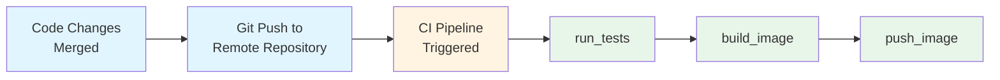
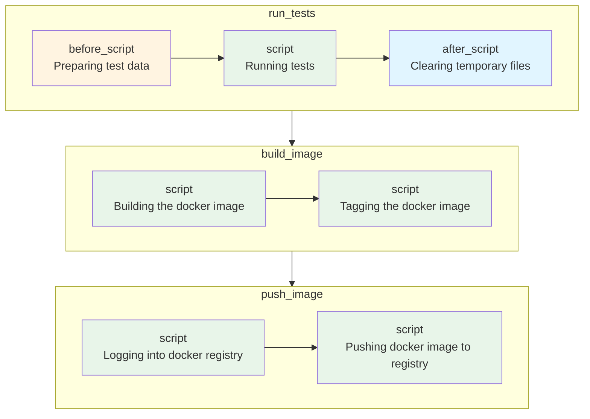

# GitLab CI/CD

## What is CI/CD?

CI/CD stands for **Continuous Integration** and **Continuous Delivery/Deployment**. It is a methodology that enables development teams to deliver code changes more frequently and reliably through automation.

---

## Continuous Integration (CI)

### Definition

Continuous Integration is a development practice where developers frequently merge their code changes into a shared repository—typically multiple times per day. Each integration is automatically verified by building the application and running automated tests.

### Core Principles

1. **Single Source Repository**: All developers commit to a shared mainline (usually `main` or `master` branch)
2. **Automated Builds**: Every commit triggers an automated build process
3. **Self-Testing Builds**: The build process includes automated tests to validate code quality
4. **Fast Feedback**: Developers receive immediate feedback on their changes
5. **Trunk-Based Development**: Short-lived feature branches merged frequently to reduce integration complexity

### What Happens in a CI Pipeline?

```
Developer Pushes Code
        │
        ▼
┌───────────────────┐
│   Code Checkout   │
└─────────┬─────────┘
          │
          ▼
┌───────────────────┐
│  Install Dependencies  │
└─────────┬─────────┘
          │
          ▼
┌───────────────────┐
│   Static Analysis │  ← Linting, Code Style, SAST
└─────────┬─────────┘
          │
          ▼
┌───────────────────┐
│    Unit Tests     │
└─────────┬─────────┘
          │
          ▼
┌───────────────────┐
│  Integration Tests│
└─────────┬─────────┘
          │
          ▼
┌───────────────────┐
│   Build Artifact  │
└─────────┬─────────┘
          │
          ▼
┌───────────────────┐
│  Security Scans   │  ← Dependency scanning, Container scanning
└───────────────────┘
```

### Industry Best Practices for CI (2024-2025)

| Practice | Description |
|----------|-------------|
| **Shift-Left Testing** | Run tests as early as possible in the pipeline |
| **Parallel Test Execution** | Split test suites to run concurrently for faster feedback |
| **Caching** | Cache dependencies and build artifacts to speed up pipelines |
| **Ephemeral Build Environments** | Use containerized, reproducible build environments |
| **Security as Code** | Integrate SAST, DAST, and dependency scanning into every build |
| **Pipeline as Code** | Define CI configuration in version-controlled files (`.gitlab-ci.yml`) |

### Benefits of CI

- **Early Bug Detection**: Issues are caught within minutes of being introduced
- **Reduced Integration Risk**: Small, frequent integrations are easier to manage than large merges
- **Improved Code Quality**: Automated quality gates enforce standards
- **Faster Development Cycles**: Developers spend less time debugging integration issues
- **Increased Confidence**: Teams can release more frequently with confidence

---

## Continuous Delivery (CD)

### Definition

Continuous Delivery is an extension of CI that ensures code is always in a deployable state. After passing all automated tests, the application can be released to production at any time with the push of a button.

### Key Characteristics

- Every change that passes automated tests is **potentially releasable**
- Deployment to production requires **manual approval**
- Release decisions are **business decisions**, not technical ones
- Maintains a **deployment pipeline** that can deliver to any environment

---

## Continuous Deployment

### Definition

Continuous Deployment takes Continuous Delivery one step further—every change that passes all stages of the production pipeline is **automatically released to production** without human intervention.

### CI vs CD vs CD: The Spectrum

```
┌─────────────────────────────────────────────────────────────────────────┐
│                                                                         │
│  Continuous Integration                                                 │
│  ├── Automated builds                                                   │
│  ├── Automated testing                                                  │
│  └── Merge to main branch                                               │
│                                                                         │
│      Continuous Delivery                                                │
│      ├── Everything in CI, plus:                                        │
│      ├── Automated deployment to staging                                │
│      ├── Manual approval for production                                 │
│      └── One-click production deployments                               │
│                                                                         │
│          Continuous Deployment                                          │
│          ├── Everything in Continuous Delivery, plus:                   │
│          └── Automated production deployments                           │
│                                                                         │
└─────────────────────────────────────────────────────────────────────────┘
```

---

## Modern CD Pipeline Architecture

### Typical CD Pipeline Stages

```
┌──────────┐    ┌──────────┐    ┌──────────┐    ┌──────────┐    ┌──────────┐
│  Build   │───▶│   Test   │───▶│  Stage   │───▶│  Review  │───▶│  Prod    │
└──────────┘    └──────────┘    └──────────┘    └──────────┘    └──────────┘
                                     │               │
                                     ▼               ▼
                               ┌──────────┐    ┌──────────┐
                               │ Smoke    │    │ Manual   │
                               │ Tests    │    │ Approval │
                               └──────────┘    └──────────┘
```

### Deployment Strategies (Industry Standard)

| Strategy | Description | Use Case |
|----------|-------------|----------|
| **Blue-Green** | Maintain two identical environments; switch traffic instantly | Zero-downtime deployments |
| **Canary** | Gradually roll out changes to a small subset of users first | Risk mitigation for critical services |
| **Rolling** | Incrementally update instances in a deployment group | Kubernetes deployments, minimal resource overhead |
| **Feature Flags** | Deploy code with features disabled, enable progressively | A/B testing, gradual rollouts |
| **Shadow/Dark Launch** | Deploy to production but don't serve real traffic | Testing with production data patterns |

### GitLab CI/CD Core Concepts

A typical GitLab CI/CD workflow follows this sequence:



**Pipeline Configuration**

GitLab CI/CD pipelines are defined using a declarative YAML configuration file (`.gitlab-ci.yml`) stored in the repository root. This file specifies:

- **Stages**: The sequential phases of the pipeline (build, test, deploy)
- **Jobs**: Individual tasks that execute within each stage
- **Variables**: Environment-specific configuration values
- **Rules**: Conditions that determine when jobs run
- **Artifacts**: Files passed between pipeline stages

This "Pipeline as Code" approach ensures that CI/CD configuration is version-controlled, reviewable, and reproducible across environments.

## Jobs (Basic Building Blocks of Pipeline)

A **job** is the fundamental execution unit in GitLab CI/CD. Each job runs in an isolated container, executes a defined set of commands, and reports a pass/fail status. Jobs are the building blocks that, when combined, form your entire CI/CD pipeline.

### Job Structure and Configuration

GitLab CI/CD pipelines are configured by placing a `.gitlab-ci.yml` file in the repository root. GitLab automatically detects this file and executes the defined pipeline on each commit.

```yaml
run_tests:
  before_script:
    - echo "Preparing test data ..."
  script:
    - echo "Running tests..." # Changes made to the pipeline
  after_script:
    - echo "Clearing temporary files..."

build_image:
  script:
    - echo "Building the docker image..."
    - echo "Tagging the docker image"

push_image:
  script:
    - echo "Logging into docker registry..."
    - echo "Pushing docker image to registry.."
```

### Job Execution Lifecycle



### Pipeline as Code

By storing CI/CD configuration in `.gitlab-ci.yml`, the pipeline definition becomes version-controlled alongside the application code. This follows the **Infrastructure as Code (IaC)** philosophy—enabling code reviews for pipeline changes, maintaining audit history, and ensuring reproducibility across environments.

Each commit triggers a full pipeline execution, automatically validating all changes against the defined quality gates.

### Stages: Grouping and Ordering Jobs

Jobs within the same stage execute in parallel, while stages themselves run sequentially. This allows pipelines to enforce execution order where dependencies exist.

In the current configuration, `run_tests`, `build_image`, and `push_image` execute in parallel by default. However, the logical dependency requires sequential execution:

1. **Test** — Validate code quality before building
2. **Build** — Create the Docker image after tests pass
3. **Push** — Upload the image to the registry only after a successful build

To enforce sequential execution and logical grouping, GitLab CI/CD provides **stages**. Stages organize related jobs together and define explicit execution order across the pipeline. When any job fails, subsequent stages are skipped and the pipeline terminates immediately, providing fail-fast behavior.

The following configuration demonstrates stage assignment:

```yaml
stages:
  - test
  - build
  - deploy

run_unit_tests:
  stage: test
  before_script:
    - echo "Preparing test data ..."
  script:
    - echo "Running unit tests..."
  after_script:
    - echo "Clearing temporary files..."

run_lint_tests:
  stage: test
  before_script:
    - echo "Preparing test data ..."
  script:
    - echo "Running lint tests..."
  after_script:
    - echo "Clearing temporary files..."

build_image:
  stage: build
  script:
    - echo "Building the docker image..."
    - echo "Tagging the docker image"

push_image:
  stage: build
  script:
    - echo "Logging into docker registry..."
    - echo "Pushing docker image to registry.."

deploy_image:
  stage: deploy
  script:
    - echo "Deploying new docker image to dev server..."
```

### Job Dependencies with `needs`

A limitation exists in the configuration above: jobs within the same stage execute in parallel by default. If `build_image` fails, `push_image` still executes because both jobs belong to the `build` stage.

This behavior is problematic when jobs have implicit dependencies. In this case, `push_image` should only execute after `build_image` completes successfully—pushing an image that failed to build serves no purpose.

GitLab CI/CD addresses this with the `needs` keyword, which creates explicit dependencies between jobs regardless of stage boundaries. The `needs` keyword enables **Directed Acyclic Graph (DAG)** scheduling, allowing fine-grained control over job execution order.

```yaml
stages:
  - test
  - build
  - deploy

run_unit_tests:
  stage: test
  before_script:
    - echo "Preparing test data ..."
  script:
    - echo "Running unit tests..."
  after_script:
    - echo "Clearing temporary files..."

run_lint_tests:
  stage: test
  before_script:
    - echo "Preparing test data ..."
  script:
    - echo "Running lint tests..."
  after_script:
    - echo "Clearing temporary files..."

build_image:
  stage: build
  script:
    - echo "Building the docker image..."
    - echo "Tagging the docker image"

push_image:
  stage: build
  needs:
    - build_image
  script:
    - echo "Logging into docker registry..."
    - echo "Pushing docker image to registry.."

deploy_image:
  stage: deploy
  script:
    - echo "Deploying new docker image to dev server..."
```

With `needs: [build_image]`, the `push_image` job waits for `build_image` to complete successfully before executing. If `build_image` fails, `push_image` is automatically skipped.

#### Visualizing Job Dependencies

GitLab provides a graphical representation of job dependencies within the pipeline interface. To view the dependency graph:

1. Navigate to **CI/CD → Pipelines** in the GitLab project
2. Select a pipeline run
3. Click **Job Dependencies** and enable **Show dependencies**

This visualization displays the DAG structure, illustrating how jobs relate to one another and their execution order based on defined `needs` relationships.

### Executing Shell Commands

GitLab CI/CD jobs support direct shell command execution within script blocks. Commands run in the job's container environment with full shell capabilities.

#### Inline Commands

Shell commands can be specified directly in the pipeline configuration:

```yaml
run_unit_tests:
  stage: test
  before_script:
    - echo "Preparing test data..."
    - pwd
    - ls
    - mkdir test-data
    - ls
  script:
    - echo "Running unit tests..."
  after_script:
    - echo "Clearing temporary files..."
    - rm -r test-data
    - ls
```

#### External Shell Scripts

For complex or reusable logic, external shell scripts improve maintainability. As pipeline configurations grow, embedding extensive shell commands directly in `.gitlab-ci.yml` becomes unwieldy and difficult to test independently.

**Best Practice**: Extract shell logic into separate script files stored in the repository.

Create a script file (`prepare-tests.sh`):

```bash
#!/bin/bash
pwd
ls
mkdir test-data
ls
```

Reference the script in the pipeline configuration:

```yaml
run_unit_tests:
  stage: test
  before_script:
    - echo "Preparing test data..."
    - chmod +x ./prepare-tests.sh
    - ./prepare-tests.sh
  script:
    - echo "Running unit tests..."
  after_script:
    - echo "Clearing temporary files..."
    - rm -r test-data
    - ls
```

This separation enables script testing outside the CI environment and keeps pipeline definitions concise.

**Note**: GitLab CI/CD pipelines execute in ephemeral environments. Each job runs in a fresh container with no state preserved from previous pipeline executions. To persist data between jobs, use [artifacts](https://docs.gitlab.com/ee/ci/jobs/job_artifacts.html) or [caching](https://docs.gitlab.com/ee/ci/caching/).

### Only: Controlling When Jobs Run

The `only` keyword specifies the conditions under which a job should execute. This is particularly useful for restricting certain jobs to specific branches.

**Problem:** By default, when a new feature branch is created, all jobs in the pipeline execute. This behavior is often undesirable—feature branches should typically only run tests, not build and push images to the registry.

**Solution:** Use the `only` keyword to restrict build and deployment jobs to the `main` branch, while allowing test jobs to run on all branches.

```yaml
stages:
  - test
  - build
  - deploy

run_unit_tests:
  stage: test
  before_script:
    - echo "Preparing test data ..."
  script:
    - echo "Running unit tests..."
  after_script:
    - echo "Clearing temporary files..."

run_lint_tests:
  stage: test
  before_script:
    - echo "Preparing test data ..."
  script:
    - echo "Running lint tests..."
  after_script:
    - echo "Clearing temporary files..."

build_image:
  only:
    - main
  stage: build
  script:
    - echo "Building the docker image..."
    - echo "Tagging the docker image"

push_image:
  only:
    - main
  stage: build
  needs:
    - build_image
  script:
    - echo "Logging into docker registry..."
    - echo "Pushing docker image to registry.."

deploy_image:
  only:
    - main
  stage: deploy
  script:
    - echo "Deploying new docker image to dev server..."
```

### Workflow Rules: Controlling Pipeline Behavior

In production environments, pipelines typically execute only when commits are pushed to the `main` branch, not on feature branches.

**Approach 1:** Add `only: main` to every job individually—this works but is repetitive and error-prone.

**Approach 2 (Recommended):** Use the `workflow` keyword to define rules that apply to the entire pipeline, not just individual jobs. This provides centralized control over when the pipeline runs.

In the example below, the pipeline will only execute for commits to the `main` branch:

```yaml
workflow:
  rules:
    - if: $CI_COMMIT_BRANCH != "main"
      when: never
    - when: always

stages:
  - test
  - build
  - deploy

run_unit_tests:
  stage: test
  before_script:
    - echo "Preparing test data ..."
  script:
    - echo "Running unit tests..."
  after_script:
    - echo "Clearing temporary files..."

run_lint_tests:
  stage: test
  before_script:
    - echo "Preparing test data ..."
  script:
    - echo "Running lint tests..."
  after_script:
    - echo "Clearing temporary files..."

build_image:
  stage: build
  script:
    - echo "Building the docker image..."
    - echo "Tagging the docker image"

push_image:
  stage: build
  needs:
    - build_image
  script:
    - echo "Logging into docker registry..."
    - echo "Pushing docker image to registry.."

deploy_image:
  stage: deploy
  script:
    - echo "Deploying new docker image to dev server..."
```

### Triggering Pipelines on Merge Requests

When developers work on feature branches, they create a merge request (called a "pull request" in GitHub and Azure DevOps) to propose changes to the `main` branch. Merge requests enable code review, ensuring only quality code enters the main branch.

**Best Practice:** Run tests when a merge request is created, not on every commit to a feature branch. This ensures:
- The `main` branch remains stable
- Feature branches (work in progress) don't trigger unnecessary pipeline runs
- Code is validated before merging

The following configuration combines workflow rules with job-level `only` constraints:

```yaml
workflow:
  rules:
    - if: $CI_COMMIT_BRANCH != "main" && $CI_PIPELINE_SOURCE != "merge_request_event"
      when: never
    - when: always

stages:
  - test
  - build
  - deploy

run_unit_tests:
  stage: test
  before_script:
    - echo "Preparing test data ..."
  script:
    - echo "Running unit tests..."
  after_script:
    - echo "Clearing temporary files..."

run_lint_tests:
  stage: test
  before_script:
    - echo "Preparing test data ..."
  script:
    - echo "Running lint tests..."
  after_script:
    - echo "Clearing temporary files..."

build_image:
  stage: build
  only:
    - main
  script:
    - echo "Building the docker image..."
    - echo "Tagging the docker image"

push_image:
  stage: build
  only:
    - main
  needs:
    - build_image
  script:
    - echo "Logging into docker registry..."
    - echo "Pushing docker image to registry.."

deploy_image:
  stage: deploy
  only:
    - main
  script:
    - echo "Deploying new docker image to dev server..."
```
